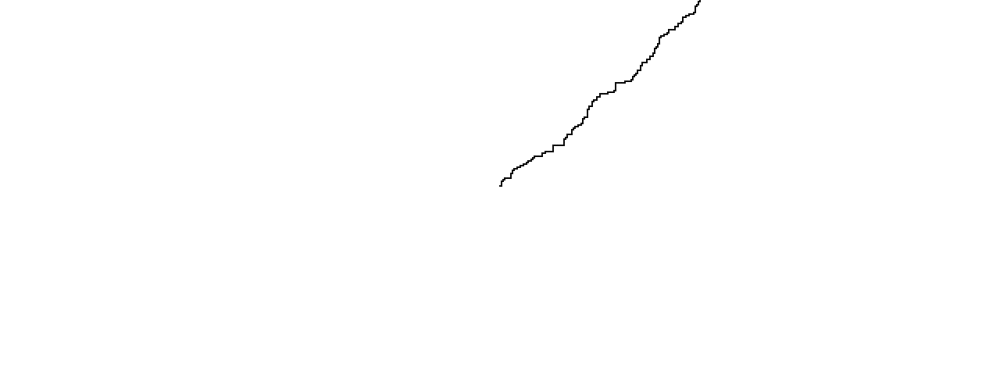

### Distribuciones de probabilidad
Distribuciones uniformes y distribuciones no uniformes, un concepto en el cual muestra como los datos tomados tienden a cierto comportamiento.

De parte de las distribuciones uniformes, es cuando hay datos que pueden aparecer (Por hacer una analogía) en intervalos constantes y todos los datos aparecen; si tenemos { 0, 1, 2, 3, 4, 5, 6, 7, 8, 9 }, si tomamos mil datos, obtendremos de cada número cien datos para cada uno, todos aparecen y aparecen de igual manera.

Ya de parte de las no uniformes, tenemos la misma lista de posibles datos { 0, 1, 2, 3, 4, 5, 6, 7, 8, 9 } y tomamos los mismos 1000 datos, pero obtenemos 600 datos obtenidos en el número 5, en el #4, #6 obtenemos 150 datos y en #3 y #7 obtenemos 50 datos y los demás no conseguimos nada. Un ejemplo agresivo pero que resume en que estas distribuciones no uniformes, no todos los elementos pueden aparecer o se pueden dar, sino que hay una desviación que favorece a ciertos elementos y consiguen más comportamiento que otros elementos.

### Código
``` js
let walker;

function setup() {
  createCanvas(640, 240);
  walker = new Walker();
  background(255);
}

function draw() {
  walker.step();
  walker.show();
}

class Walker {
  constructor() {
    this.x = width / 2;
    this.y = height / 2;
  }

  show() {
    stroke(0);
    point(this.x, this.y);
  }

step() {
    const choice = floor(randomGaussian(0,0.3));
    if (choice == 0) {
      this.x++;
    } else if (choice == 1) {
      this.x--;
    } else if (choice == 2) {
      this.y++;
    } else {
      this.y--;
    }
  }
}
```



Cambiando solo el random dentro valor de choice por randomGaussian(), de manera que pueda hacer la distribución no uniforme, ya de ahí utilizamos el 0 porque es el dato que estoy buscando obtener que es para la derecha, utilizando media 0 y una desviación estandar por debajo de 1 sirve para poder obtener este resultado en el que intentará irse para la derecha, pero como busca los demás datos entonces va intentando ir a la izquierda y por eso se mueve para arriba poco a poco.
