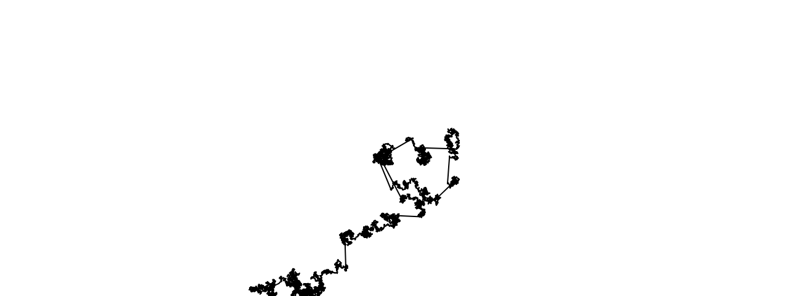
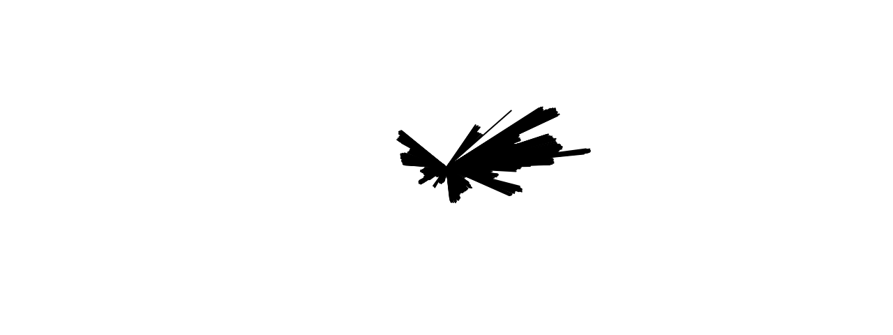

### Lévy Flight
Desde su concepto, es practicamente un paseo aleatorio en el cual hay una probabilidad que en esa distribución de valores haya algún punto que se generé un salto de valores muy amplio, permitiendo que abarque más espacio.

Este uso es bueno para poder tener un sistema sencillo dentro de un juego para que movimientos de npcs o critters se vea más variado, que no solo se vaya como centrando en un punto sino que puedan moverse hasta otra zona e interactue con esa zona.



```js
let walker;

function setup() {
  createCanvas(640, 240);
  walker = new Walker();
  background(255);
  frameRate(240)
}

function draw() {
  walker.step();
  walker.show();
}

class Walker {
  constructor() {
    this.x = width / 2;
    this.y = height / 2;
    //Guardar la posición previa del punto que se dibuja
    this.prevX = this.x;
    this.prevY = this.y;
  }

  show() {
    stroke(0);
    line(this.x, this.y, this.prevX, this.prevY);
  }

step() {
    const choice = floor(random(8));
    let r = random(1);
    
    if(r < 0.001){
      this.prevX = this.x;
      this.prevY = this.y;
      this.x += random(-30, 30);
      this.y += random(-30, 30);
    } else{
      this.prevX = this.x;
      this.prevY = this.y;
      this.x += random(-1, 1);
      this.y += random(-1, 1);
    }
  }
}
```

### Extra
Dejaré este pequeño código acá antes de hacer que funcionará el levy flight, ya que me pareció curioso como se pueso a dibujar las líneas alrededor del centro



```js
let walker;

function setup() {
  createCanvas(640, 240);
  walker = new Walker();
  background(255);
}

function draw() {
  walker.step();
  walker.show();
}

class Walker {
  constructor() {
    this.x = width / 2;
    this.y = height / 2;
    this.prevX = this.x;
    this.prevY = this.y;
  }

  show() {
    stroke(0);
    line(this.x, this.y, this.prevX, this.prevY);
  }

step() {
    const choice = floor(random(8));
    let r = random(1);
    
    if(r < 0.01){
      //Can be changed to have more space between jumps
      this.x += random(-30, 30);
      this.y += random(-30, 30);
    } else{
      this.x += random(-1, 1);
      this.y += random(-1, 1);
    }
  }
}
```
