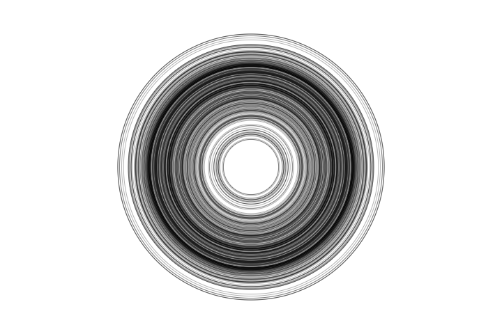

### Perlin Noise
* A simple vista, se puede ver que de ambas gráficas, la de la izquierda, obtiene un suavizado en sus pendientes, mostrando que conforme pase el tiempo, los datos obtenidos de los números aleatorios se vean interpolados y se genere ese suavizado en la graficación comparado con la gráfica de la derecha que directamente pareciera que pasa una línea entre ambos puntos sucesivamente.
* Ahora, jugando con el código dado en la gráfica de la izquerda, modifiqué tal código eliminando el dibujo del vertex, y dejé el ciclo for para utilizar otra figura de las bases dadas por p5js, de ahí tomé la información de la variable offset (Donde directamente se utiliza la función noise()) y lo demás que ya estaba construido, de ahí agregué al final un circulo en la posición, pero que varía su radio, generando lo que se ve en la siguiente imagen que va generando varios circulos conforme pasa el tiempo con diferentes tamaños.


Como nota, no tengo idea por qué pasa que conforme se generan circulos, desaparecen, generando el efecto que se da, pero al menos pude ver como las variaciones se generan conforme pasa el tiempo.



```js
let t = 0.0;

function setup() {
  createCanvas(360, 240);
}

function draw() {
  background(255);
  let xoff = t;
  noFill();
  stroke(0);
  strokeWeight(0.15);
  push();
  translate(width/2, height/2);
  for (let i = 0; i < width; i++) {
    let y = noise(xoff) * height;
    xoff += 0.1;
    circle(0,0,y);
  }
  pop();
  t += 0.001;
}
```
