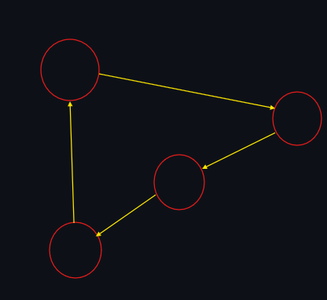

### Aplicaciones en el entretenimiento digital

Las aplicaciones de los temas vistos en esta unidad puedo verlas aplicadas en estos tres objetos dentro del desarrollo de videojuegos:

* La primera es la más sencilla de hacer que un critter/npc/enemy se mueva en su entorno en puntos diferentes con cierta tendencia a algunos lados, o que directamente para llegar un punto y que al llegar esperar y moverse al siguiente.

* La segunda es generación procedural, juegos como Minecraft, Terraria o si no mal estoy No Man's Sky también tiene, utiliza un string de enteros que al crear un mundo se genera de manera aleatoria, y esos mismos números son los que van a dar la forma al mundo, generando con ciertas altitudes, cierta distribución de zonas, etc.
* Por último es temas de texturas, ya sea para crear pinceles o tener un generador de texturas se puede tener una herramienta que permite tener relieves de maneras aleatorias pero que se sientan naturales con ruido de Perlin u otros elementos aleatorios.
