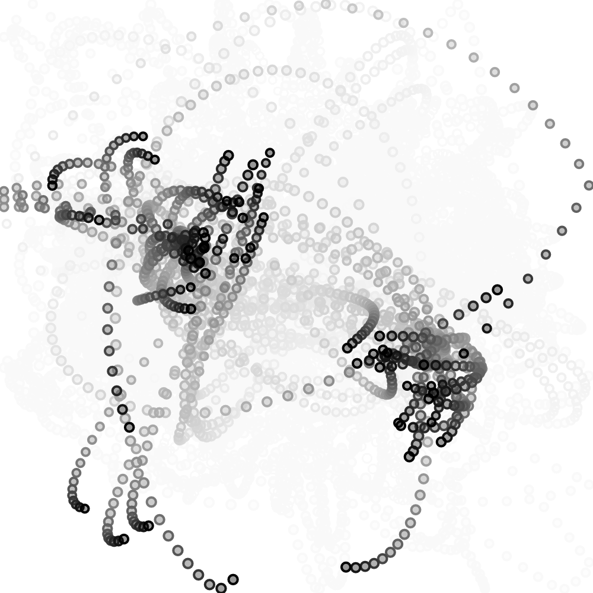
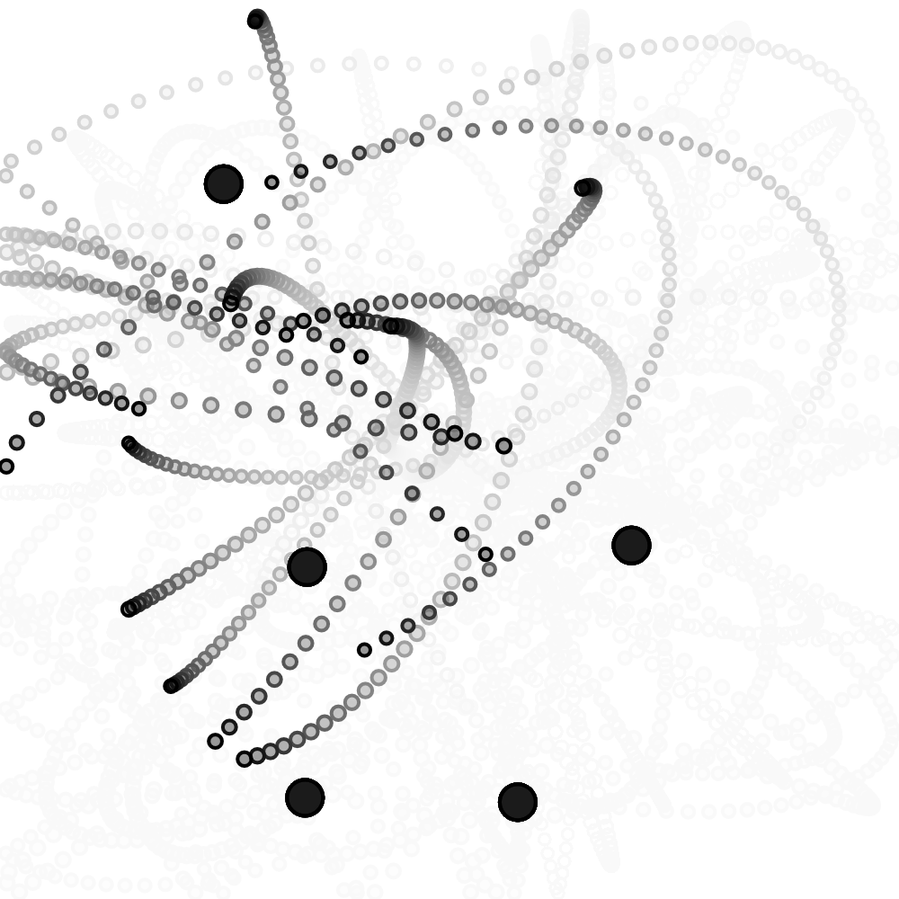

```js
let bodies = [];
let suns = [];
let G = 0.2;

function setup() {
  createCanvas(500, 500);
  
  for (let i = 0; i < 50; i++) {
    let pos = p5.Vector.random2D();
    let vel = pos.copy();
    vel.setMag(random(10, 15));
    pos.setMag(random(100, 150));
    //vel.rotate(PI / 2);
    let m = random(10, 15);
    bodies[i] = new Body(pos.x, pos.y, vel.x, vel.y, m);
  }
  
  for (let i = 0; i < 5; i++) {
  let validPosition = false;
  let pos;

    while (!validPosition) {
      pos = createVector(random(-width / 2 + 50, width / 2 - 50), 
                       random(-height / 2 + 50, height / 2 - 50));
      validPosition = true;

      for (let j = 0; j < i; j++) {
        if (pos.dist(suns[j].pos) < 80) {
          validPosition = false;
          break;
        }
      }
    }

    suns[i] = new Body(pos.x, pos.y, 0, 0, 100);
  }
}

function draw() {
  background(255, 20);
  translate(width / 2, height / 2);
  
  for (let bodi of bodies) {
    for(let sun of suns){
        sun.attract(bodi);
      for (let other of bodies) {
        if (bodi !== other) {
          bodi.attract(other);
        }
      }
    }
  }

  for (let bodi of bodies) {
    bodi.update();
    bodi.bounceEdges();
    bodi.show();
  }
  
  /*for(let sun of suns){
    sun.show();
  }*/
  
  //sun.show();
}


class Body {
  constructor(x, y, vx, vy, m) {
    this.pos = createVector(x, y);
    this.vel = createVector(vx, vy);
    this.acc = createVector(0, 0);
    this.mass = m;
    this.r = sqrt(this.mass) * 1;
  }

  applyForce(force) {
    let f = p5.Vector.div(force, this.mass);
    this.acc.add(f);
  }

  attract(mover) {
    let force = p5.Vector.sub(this.pos, mover.pos);
    let distanceSq = constrain(force.magSq(), 100, 1000);
    let G = 1;
    let strength = (G * (this.mass * mover.mass)) / distanceSq;
    force.setMag(strength);
    mover.applyForce(force);
  }

  update() {
    this.vel.add(this.acc);
    this.pos.add(this.vel);
    this.acc.set(0, 0);
  }

  show() {
    stroke(0);
    strokeWeight(2);
    fill(0, 100);
    ellipse(this.pos.x, this.pos.y, this.r * 2);
  }
  
  bounceEdges() {
  let bounce = -0.9;
  let halfWidth = width / 2;
  let halfHeight = height / 2;

  if (this.pos.x > halfWidth - this.r) {
    this.pos.x = halfWidth - this.r;
    this.vel.x *= bounce;
  } else if (this.pos.x < -halfWidth + this.r) {
    this.pos.x = -halfWidth + this.r;
    this.vel.x *= bounce;
  }

  if (this.pos.y > halfHeight - this.r) {
    this.pos.y = halfHeight - this.r;
    this.vel.y *= bounce;
  } else if (this.pos.y < -halfHeight + this.r) {
    this.pos.y = -halfHeight + this.r;
    this.vel.y *= bounce;
  }
}
}

```
Igual que en el texto guía para los n-cuerpos, más que tener varios elementos en el mismo código copiando y pegando, tengo dos arreglos que me permiten tener una cantidad que especifíque en el tamaño del arreglo, lo cual permite directamente el uso de varios cuerpos y varias operaciones a la vez, con, por así decirlo, utilizando ciclos foreach, se van aplicando independientemente a cada objeto cada operación que se especifíque, de manera que no se sobrecarguen en varios objetos los mismos resultados.

Aquí no me centré solo en los objetos que orbitan (bodies) sino que también me centré en los soles estáticos (suns), de manera que los objetos que orbitan reaccionarán ante los soles, y aunque hay varios for en el draw, sigue funcionando de manera que aplica a todos los objetos en todas las instancias (No creo que sea lo más optimo pero funciona en espacios pequeños como este).

https://editor.p5js.org/SheiinX/sketches/E8dAM9tTD




