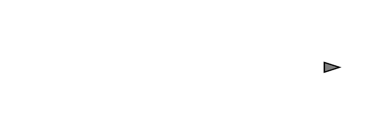

```js
let aKey = false;
let dKey = false;

function setup() {
  createCanvas(640, 240);
  mover = new Mover();
}

function draw() {
  background(255);
  mover.update();
  mover.checkEdges();
  mover.display();
}

function keyPressed() {
  if (key === 'd' || key === 'D') {
    dKey = true;
  }
  if (key === 'a' || key === 'A') {
    aKey = true;
  }
}

function keyReleased() {
  if (key === 'd' || key === 'D') {
    dKey = false;
  }
  if (key === 'a' || key === 'A') {
    aKey = false;
  }
}

class Mover {
  constructor() {
    this.position = createVector(width / 2, height / 2);
    this.velocity = createVector(0, 0);
    this.acceleration = createVector(0, 0);
    this.topspeed = 4;
  }

  update() {
    let directionAcc = createVector(0,0);
    
    if(keyIsDown(39)){
      this.directionAcc = createVector(0.1, 0);
    }
    if(keyIsDown(37)){
      this.directionAcc = createVector(-0.1, 0);
    }

    this.velocity.add(this.directionAcc);
    this.velocity.limit(this.topspeed);
    this.position.add(this.velocity);
  }

  display() {
     let angle = this.velocity.heading();

    stroke(0);
    strokeWeight(2);
    fill(127);
    push();
    translate(this.position.x, this.position.y);
    rotate(angle);

    beginShape();
    vertex(15, 0);
    vertex(-10, -8);
    vertex(-10, 8);  
    endShape(CLOSE);

    pop();
  }

  checkEdges() {
    if (this.position.x > width) {
      this.position.x = 0;
    } else if (this.position.x < 0) {
      this.position.x = width;
    }

    if (this.position.y > height) {
      this.position.y = 0;
    } else if (this.position.y < 0) {
      this.position.y = height;
    }
  }
}
```

https://editor.p5js.org/SheiinX/sketches/OqLCyQmme


