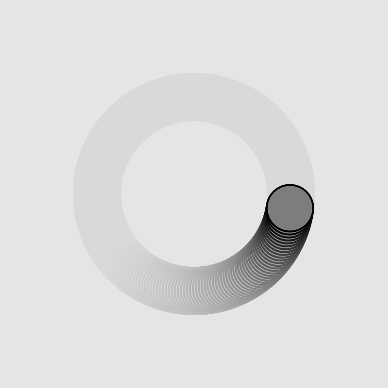

```js
let period = 200;
let amplitude = 100;
let phase = 10;

function setup() {
  createCanvas(400, 400);
}

function draw() {
  background(220,10);
  
  let x = amplitude * sin( ((TWO_PI * frameCount) / period) + phase);
  let y = amplitude * cos( ((TWO_PI * frameCount) / period) + phase);

  stroke(0);
  strokeWeight(2);
  translate(width / 2, height / 2);

  fill(125);
  circle(x, y, 48);
}
```

https://editor.p5js.org/SheiinX/sketches/EqjsTlbbg


