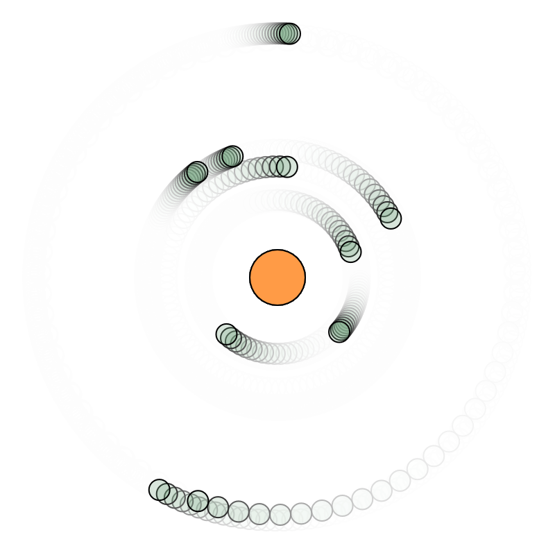

```js
let objectF = [];
let attractor;
let G = 1;

function setup() {
  createCanvas(400, 400);
  
  attractor = new Attractor();
  
  for (let i = 0; i < 10; i++){
    objectF[i] = new SimpleClass(random(TWO_PI), random(50, 200)); 
  }
}

function draw() {
  background(255, 50);
  
  attractor.show();
  
  for (let i = 0; i < objectF.length; i++){
    objectF[i].orbitAround(attractor);
    objectF[i].show();
  }
}

class SimpleClass{
  constructor(startAngle, orbitRadius){
    this.radius = 15;
    this.mass = 10;
    this.orbitRadius = orbitRadius;
    this.theta = startAngle;
    this.angularSpeed = random(0.01, 0.09);
  }
  
  orbitAround(attractor) {
    this.theta += this.angularSpeed;
    this.position = createVector(
      attractor.position.x + this.orbitRadius * cos(this.theta),
      attractor.position.y + this.orbitRadius * sin(this.theta)
    );
  }
  
  show() {
    stroke(0);
    strokeWeight(1);
    fill(25,105,45,41);
    circle(this.position.x, this.position.y, this.radius);
  }
}

class Attractor {
  constructor() {
    this.position = createVector(width / 2, height / 2);
    this.mass = 20;
  }

  show() {
    stroke(0);
    fill(255,155,70);
    circle(this.position.x, this.position.y, this.mass * 2);
  }
}
```

https://editor.p5js.org/SheiinX/sketches/DU4B01HOX


