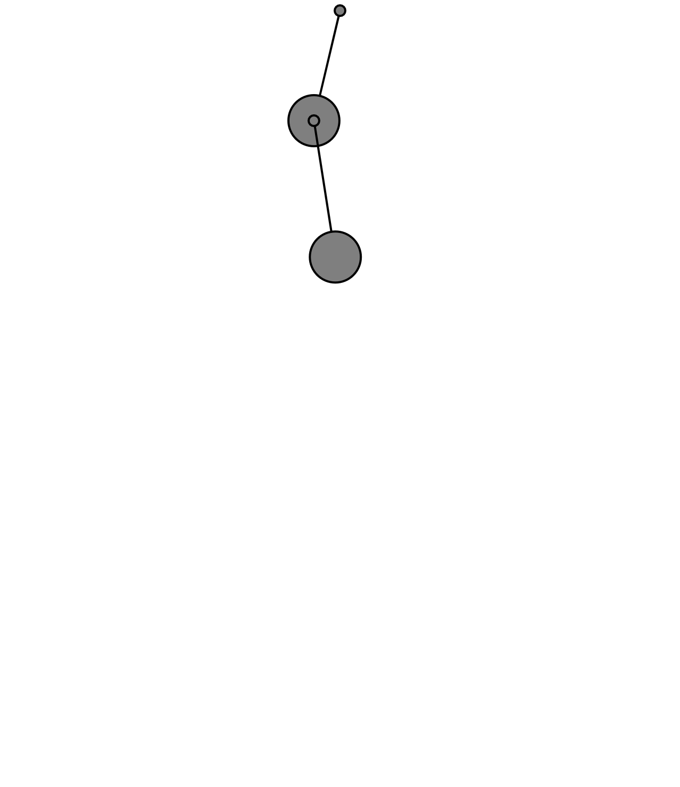

https://editor.p5js.org/SheiinX/sketches/tA6mHj9f4

```js
let bob;
let bob2;

// Spring object
let spring;
let spring2;

function setup() {
  createCanvas(640, 740);
  // Create objects at starting position
  // Note third argument in Spring constructor is "rest length"
  spring = new Spring(width / 2, 10, 100);
  bob = new Bob(width / 2, 100);
  
  spring2 = new Spring(bob.position.x, bob.position.y, 100);
  bob2 = new Bob(width/2, 200);
}

function draw() {
  background(255);

  // Apply a gravity force to the bob
  let gravity = createVector(0, 2);
  bob.applyForce(gravity);
  bob2.applyForce(gravity);


  // Update bob
  bob.update();
  bob.handleDrag(mouseX, mouseY);
  
  bob2.update();
  bob2.handleDrag(mouseX, mouseY);
  
  //set para que el anchor se vaya actualizando
  spring2.anchor.set(bob.position.x, bob.position.y);

  // Connect the bob to the spring (this calculates the force)
  spring.connect(bob);
  spring2.connect(bob2);
  //spring2.connect(bob);

  // Constrain spring distance between min and max
  spring.constrainLength(bob, 30, 200);
  spring2.constrainLength(bob2, 30, 200);

  // Draw everything
  spring.showLine(bob); // Draw a line between spring and bob
  bob.show();
  spring.show();
  
  spring2.showLine(bob2);
  bob2.show();
  spring2.show();
}

function mousePressed() {
  bob.handleClick(mouseX, mouseY);
  bob2.handleClick(mouseX, mouseY);
}

function mouseReleased() {
  bob.stopDragging();
  bob2.stopDragging();
}

class Spring {
  constructor(x, y, length) {
    this.anchor = createVector(x, y);
    this.restLength = length;
    this.k = 0.2;
  }
  // Calculate and apply spring force
  connect(bob) {
    // Vector pointing from anchor to bob location
    let force = p5.Vector.sub(bob.position, this.anchor);
    // What is distance
    let currentLength = force.mag();
    // Stretch is difference between current distance and rest length
    let stretch = currentLength - this.restLength;

    //{!2 .bold} Direction and magnitude together!
    force.setMag(-1 * this.k * stretch);

    //{!1} Call applyForce() right here!
    bob.applyForce(force);
    
    if (this.anchor !== createVector(width / 2, 10)) { 
        let reactionForce = force.copy().mult(-1);
        
        // Buscar qué bob está anclado
        if (this.anchor instanceof Bob) { 
            this.anchor.applyForce(reactionForce);
        }
    }
  }

  constrainLength(bob, minlen, maxlen) {
    //{!1} Vector pointing from Bob to Anchor
    let direction = p5.Vector.sub(bob.position, this.anchor);
    let length = direction.mag();

    //{!1} Is it too short?
    if (length < minlen) {
      direction.setMag(minlen);
      //{!1} Keep position within constraint.
      bob.position = p5.Vector.add(this.anchor, direction);
      bob.velocity.mult(0);
      //{!1} Is it too long?
    } else if (length > maxlen) {
      direction.setMag(maxlen);
      //{!1} Keep position within constraint.
      bob.position = p5.Vector.add(this.anchor, direction);
      bob.velocity.mult(0);
    }
  }

  //{!5} Draw the anchor.
  show() {
    fill(127);
    circle(this.anchor.x, this.anchor.y, 10);
  }

  //{!4} Draw the spring connection between Bob position and anchor.
  showLine(bob) {
    stroke(0);
    line(bob.position.x, bob.position.y, this.anchor.x, this.anchor.y);
  }
}

class Bob {
  constructor(x, y) {
    this.position = createVector(x, y);
    this.velocity = createVector();
    this.acceleration = createVector();
    this.mass = 24;
    this.radius = this.mass * 2;
    // Arbitrary damping to simulate friction / drag
    this.damping = 0.98;
    // For user interaction
    this.dragOffset = createVector();
    this.dragging = false;
  }

  // Standard Euler integration
  update() {
    this.velocity.add(this.acceleration);
    this.velocity.mult(this.damping);
    this.position.add(this.velocity);
    this.acceleration.mult(0);
  }

  // Newton's law: F = M * A
  applyForce(force) {
    let f = force.copy();
    f.div(this.mass);
    this.acceleration.add(f);
  }

  // Draw the bob
  show() {
    stroke(0);
    strokeWeight(2);
    fill(127);
    if (this.dragging) {
      fill(200);
    }
    circle(this.position.x, this.position.y, this.radius);
  }

  handleClick(mx, my) {
    let d = dist(mx, my, this.position.x, this.position.y);
    if (d < this.mass) {
      this.dragging = true;
      this.dragOffset.x = this.position.x - mx;
      this.dragOffset.y = this.position.y - my;
    }
  }

  stopDragging() {
    this.dragging = false;
  }

  handleDrag(mx, my) {
    if (this.dragging) {
      let d = dist(mx, my, this.position.x, this.position.y);
      if (d > this.mass * 1.5) {
        this.stopDragging();
      } else {
        this.position.x = mx + this.dragOffset.x;
        this.position.y = my + this.dragOffset.y;
      }
    }
  }
}
```


