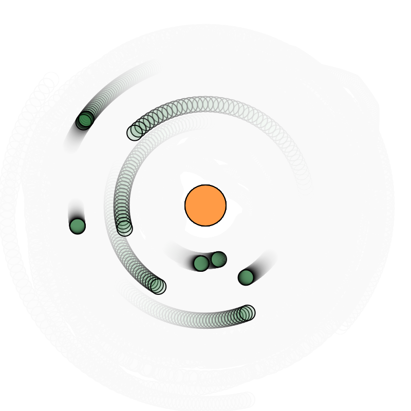

### Propuesta
Utilizando de mi parte la simulación de atracción en la actividad 7 de esta unidad, me gustaría cambiarlo para que pueda moverse a base de los inputs que le pase, de manera que pueda modificar la manera en que haga la fuerza de atracción presentada. Este código ya en si estaba construido y ya funcionaba con el movimiento sinusoide, la idea es directamente modificarlo para que se peuda modificar el movimiento a base de las teclas, empezando con la dirección.

En el caso de la dirección fue posible teniendo una variable de dirección y que en la función se multiplique para cambiar la dirección dependiendo si es 1 o -1
```js
orbitAround(attractor) {
    this.theta += this.angularSpeed * direction;

    this.position.set(
      attractor.position.x + this.orbitRadius * cos(this.theta),
      attractor.position.y + this.orbitRadius * sin(this.theta)
    );
  }
```

Luego está el de que pueda acercarse o alejarse, gracias a gpt se pudo dar la siguiente función la cual agrega el orbitRadius (Utilizado en la anterior mostrada función) y tener un constrain de movimiento para que ni se acerque mucho, ni se aleje mucho

```js
changeOrbit(amount) {
    this.orbitRadius = constrain(this.orbitRadius + amount, 30, 250);
  }
```

Y por último solo asignarle a una teclas para que cuando sean presionadas, el movimiento aumente la velocidad a un lado o al otro tomando el angularSpeed variable para hacerlo

```js
if(keyIsDown(81)===true){
    for (let obj of objectF) {
      obj.angularSpeed += 0.001;
    }
  }
  if(keyIsDown(69)===true){
    for (let obj of objectF) {
      obj.angularSpeed -= 0.001;
    }
  }
```

```js
let objectF = [];
let attractor;
let G = 1;

let direction = 1;

let pressedKey = 0;

function setup() {
  createCanvas(400, 400);
  
  attractor = new Attractor();
  
  for (let i = 0; i < 10; i++){
    objectF[i] = new SimpleClass(random(TWO_PI), random(50, 200)); // Órbitas entre 50 y 200 px
  }
}

function draw() {
  background(255, 20);
  
  attractor.show();
  
  for (let i = 0; i < objectF.length; i++){
    objectF[i].orbitAround(attractor);
    objectF[i].show();
  }
  
  if(keyIsDown(65)=== true){
    direction = -1;
  }
  if(keyIsDown(68)=== true){
    direction = 1;
  }
  if(keyIsDown(81)===true){
    for (let obj of objectF) {
      obj.angularSpeed += 0.001;
    }
  }
  if(keyIsDown(69)===true){
    for (let obj of objectF) {
      obj.angularSpeed -= 0.001;
    }
  }
  if(keyIsDown(87)===true){
    pressedKey += 1;
    for (let obj of objectF) {
      obj.changeOrbit(pressedKey);
    }
    pressedKey = 0;
  }
  if(keyIsDown(83)===true){
    pressedKey -= 1;
    for (let obj of objectF) {
      obj.changeOrbit(pressedKey);
    }
    pressedKey = 0;
  }
}

class SimpleClass {
  constructor(startAngle, orbitRadius) {
    this.position = createVector(0, 0);
    this.radius = 15;
    this.mass = 10;
    this.orbitRadius = orbitRadius;
    this.theta = startAngle;
    this.angularSpeed = random(0.01, 0.09);
  }
  
  orbitAround(attractor) {
    this.theta += this.angularSpeed * direction;

    this.position.set(
      attractor.position.x + this.orbitRadius * cos(this.theta),
      attractor.position.y + this.orbitRadius * sin(this.theta)
    );
  }

  changeOrbit(amount) {
    this.orbitRadius = constrain(this.orbitRadius + amount, 30, 200);
  }
  
  show() {
    stroke(0);
    strokeWeight(1);
    fill(25, 105, 45, 41);
    circle(this.position.x, this.position.y, this.radius);
  }
}

class Attractor {
  constructor() {
    this.position = createVector(width / 2, height / 2);
    this.mass = 20;
    //this.theta = random(TWO_PI);
  }

  show() {
    stroke(0);
    fill(255, 155, 70);
    //fill(cos(this.theta),sin(this.theta),sin(this.theta))
    circle(this.position.x, this.position.y, this.mass * 2);
  }
}
```

https://editor.p5js.org/SheiinX/sketches/MBEvUzBkE


