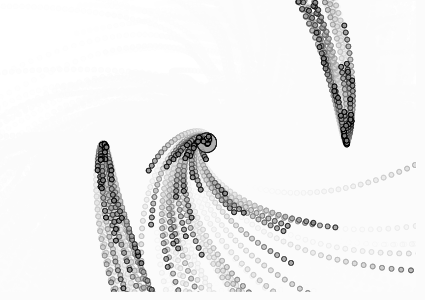

https://editor.p5js.org/SheiinX/sketches/7RtGiVMx1

```js
let emitters = [];
let attractor = null;

function setup() {
  createCanvas(680, 480);
  emitters.push(new Emitter(width / 1.2, height/2));
  emitters.push(new Emitter(width / 4, height/2));
  emitters.push(new Emitter(width / 2, height/2));
}

function draw() {
  background(255, 30);

  let gravity = createVector(0, 0.1);
  let wind = createVector(0.5, 0);
  let reverseWind = wind.copy().mult(-1); 

  for (let emitter of emitters) {
    emitter.applyForce(gravity);
    
    if (keyIsDown(65)) emitter.applyForce(reverseWind);
    if (keyIsDown(68)) emitter.applyForce(wind);
    if (keyIsDown(32)) {
      let centered = createVector(width / 2, height / 2);
      for (let i = 0; i < emitters.length; i++) {
        emitters[i].applyExplosion(centered, i * 10);
      }
    }
    
    emitter.addParticle();
    
    if (attractor) emitter.applyAttractor(attractor);
    
    emitter.run();
  }

  if (attractor) attractor.show();
}

function mousePressed() {
  attractor = new Attractor(mouseX, mouseY);
}

function mouseReleased() {
  attractor = null;
}

class Particle {
  constructor(x, y) {
    this.position = createVector(x, y);
    this.acceleration = createVector(0, 0.0);
    this.velocity = createVector(random(-1, 1), random(-2, 0));
    this.lifespan = 255.0;
    this.mass = 1;
  }

  run() {
    this.update();
    this.show();
  }

  applyForce(force) {
    let f = force.copy();
    f.div(this.mass);
    this.acceleration.add(f);
  }

  update() {
    this.velocity.add(this.acceleration);
    this.position.add(this.velocity);
    this.acceleration.mult(0);
    this.lifespan -= 2.0;
  }

  show() {
    stroke(0, this.lifespan);
    strokeWeight(2);
    fill(127, this.lifespan);
    circle(this.position.x, this.position.y, 8);
  }

  isDead() {
    return this.lifespan < 0.0;
  }
}

class Emitter {

  constructor(x, y) {
    this.origin = createVector(x, y);
    this.particles = [];
  }

  addParticle() {
    this.particles.push(new Particle(this.origin.x, this.origin.y));
  }

  applyForce(force) {
    for (let particle of this.particles) {
      particle.applyForce(force);
    }
  }

  run() {
    for (let i = this.particles.length - 1; i >= 0; i--) {
      const particle = this.particles[i];
      particle.run();
      if (particle.isDead()) {
        this.particles.splice(i, 1);
      }
    }
  }
}

Emitter.prototype.applyAttractor = function(attractor) {
  for (let particle of this.particles) {
    let force = attractor.attract(particle);
    particle.applyForce(force);
  }
}

Emitter.prototype.applyExplosion = function(centered, timeOffset = 0) {
  for (let particle of this.particles) {
    let dir = p5.Vector.sub(particle.position, centered);
    let distance = dir.mag();
    distance = constrain(distance, 10, 200);

    let n = noise(particle.position.x * 0.01, particle.position.y * 0.01, frameCount * 0.01 + timeOffset);
    let strength = map(n, 0, 0.1, 0.3, 0.5);
    dir.setMag(strength * 0.2);

    particle.applyForce(dir);
  }
}

class Attractor {
  constructor(x, y) {
    this.position = createVector(x, y);
    this.strength = 200;
  }

  attract(particle) {
    let dir = p5.Vector.sub(this.position, particle.position);
    let distance = dir.mag();
    distance = constrain(distance, 10, 100);
    
    let angle = atan2(dir.y, dir.x);
    let orbit = createVector(cos(angle + PI / 2), sin(angle + PI / 2));
    orbit.mult(0.5);
    
    let strength = (this.strength) / (distance * distance);
    dir.setMag(strength);
    
    let totalForce = p5.Vector.add(dir, orbit);
    return totalForce;
  }

  show() {
    stroke(0);
    fill(150, 100);
    ellipse(this.position.x, this.position.y, 32);
  }
}
```

Sacando de una vez, esto utilicé uno de los códigos de ejemplo que ya andaba utilizando fuerzas, y le terminé aplicando una extra para controlar la dirección del viento y esta como afecta a las particulas que se van generando.

```js
let gravity = createVector(0, 0.1);
  let wind = createVector(0.5, 0);
  let reverseWind = wind.copy().mult(-1); 

  for (let emitter of emitters) {
    emitter.applyForce(gravity);
    
    if (keyIsDown(65)) emitter.applyForce(reverseWind);
    if (keyIsDown(68)) emitter.applyForce(wind);
    if (keyIsDown(32)) {
      let centered = createVector(width / 2, height / 2);
      for (let i = 0; i < emitters.length; i++) {
        emitters[i].applyExplosion(centered, i * 10);
      }
    }
```

De ahí también se aplicó temas de uso de vectores, para poder ir cambiando las direcciones y hacer los calculos para los movimientos de las particulas sobre el espacio

```js
let dir = p5.Vector.sub(particle.position, centered);
    let distance = dir.mag();
```

```js
dir.setMag(strength * 0.2);
```

Ya para describir un tema más específico, aquí también se utilizó funciones trigonométricas para poder hacer un attractor dentro del proyecto que moviera las particulas sobre un eje a cierta fuerza

```js
function mousePressed() {
  attractor = new Attractor(mouseX, mouseY);
}

function mouseReleased() {
  attractor = null;
}

Emitter.prototype.applyAttractor = function(attractor) {
  for (let particle of this.particles) {
    let force = attractor.attract(particle);
    particle.applyForce(force);
  }
}

class Attractor {
  constructor(x, y) {
    this.position = createVector(x, y);
    this.strength = 200;
  }

  attract(particle) {
    let dir = p5.Vector.sub(this.position, particle.position);
    let distance = dir.mag();
    distance = constrain(distance, 10, 100);
    
    let angle = atan2(dir.y, dir.x);
    let orbit = createVector(cos(angle + PI / 2), sin(angle + PI / 2));
    orbit.mult(0.5);
    
    let strength = (this.strength) / (distance * distance);
    dir.setMag(strength);
    
    let totalForce = p5.Vector.add(dir, orbit);
    return totalForce;
  }

  show() {
    stroke(0);
    fill(150, 100);
    ellipse(this.position.x, this.position.y, 32);
  }
}
```

y por último para tener un poco más de aleatoriedad, se aplicó un perlin noise para que se fueran repeliendo las particulas cada vez que uno presionará el space, de manera que estos tuvieran diferentes fuerzas al lanzarlo

```js
function draw() {
  background(255, 30);

  let gravity = createVector(0, 0.1);
  let wind = createVector(0.5, 0);
  let reverseWind = wind.copy().mult(-1); 

  for (let emitter of emitters) {
    emitter.applyForce(gravity);
    
    if (keyIsDown(65)) emitter.applyForce(reverseWind); //A
    if (keyIsDown(68)) emitter.applyForce(wind);//D
    if (keyIsDown(32)) {
      let centered = createVector(width / 2, height / 2);
      for (let i = 0; i < emitters.length; i++) {
        emitters[i].applyExplosion(centered, i * 10);
      } //Space
    }
    
    emitter.addParticle();
    
    if (attractor) emitter.applyAttractor(attractor);
    
    emitter.run();
  }

  if (attractor) attractor.show();
}

Emitter.prototype.applyExplosion = function(centered, timeOffset = 0) {
  for (let particle of this.particles) {
    let dir = p5.Vector.sub(particle.position, centered);
    let distance = dir.mag();
    distance = constrain(distance, 10, 200);

    let n = noise(particle.position.x * 0.01, particle.position.y * 0.01, frameCount * 0.01 + timeOffset);
    let strength = map(n, 0, 0.01, 0.03, 0.05);
    dir.setMag(strength * 0.2);

    particle.applyForce(dir);
  }
}
```




