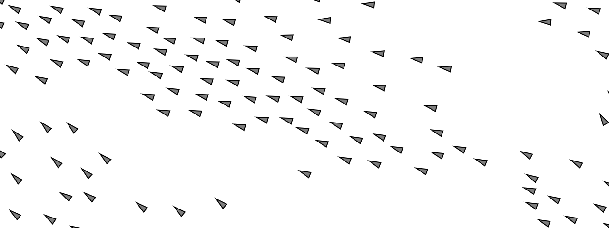
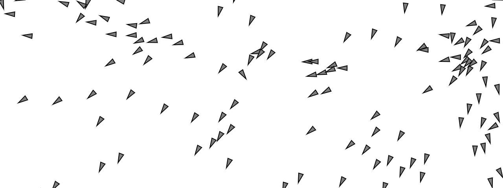
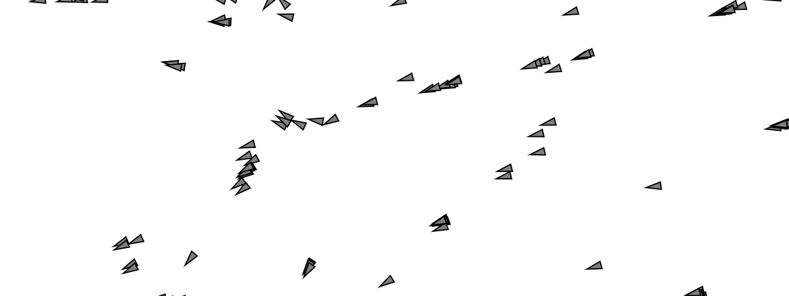
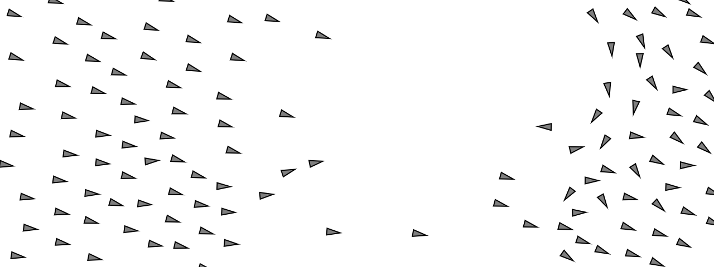

1. Rules
* Separación
```js
separate(boids) {
    let desiredSeparation = 25;
    let steer = createVector(0, 0);
    let count = 0;
    // For every boid in the system, check if it's too close
    for (let i = 0; i < boids.length; i++) {
      let d = p5.Vector.dist(this.position, boids[i].position);
      // If the distance is greater than 0 and less than an arbitrary amount (0 when you are yourself)
      if (d > 0 && d < desiredSeparation) {
        // Calculate vector pointing away from neighbor
        let diff = p5.Vector.sub(this.position, boids[i].position);
        diff.normalize();
        diff.div(d); // Weight by distance
        steer.add(diff);
        count++; // Keep track of how many
      }
    }
    // Average -- divide by how many
    if (count > 0) {
      steer.div(count);
    }

    // As long as the vector is greater than 0
    if (steer.mag() > 0) {
      // Implement Reynolds: Steering = Desired - Velocity
      steer.normalize();
      steer.mult(this.maxspeed);
      steer.sub(this.velocity);
      steer.limit(this.maxforce);
    }
    return steer;
  }
````

Regla hecha para que los boids se vayan separando los unos de los otros; en la primera parte se saca la distancia que esté cada boid de cada uno let d = p5.Vector.dist(this.position, boids[i].position); , de ahí saca la diferencia tomando en cuenta una condición por si está demasiado cerca if (d > 0 && d < desiredSeparation), y va aumentando un contador que luego se vuelve parte del steer para ver cuales objetos están demasiado cerca del boid en el que esté parado el arreglo. Ya con la cantidad, ya se empieza a calcular la formula de Steering, y con esto ya se pueden separar los boids los unos con los otros al aplicar la fuerza más arriba del código.

* Alineación
```js
// Alignment
  // For every nearby boid in the system, calculate the average velocity
  align(boids) {
    let neighborDistance = 50;
    let sum = createVector(0, 0);
    let count = 0;
    for (let i = 0; i < boids.length; i++) {
      let d = p5.Vector.dist(this.position, boids[i].position);
      if (d > 0 && d < neighborDistance) {
        sum.add(boids[i].velocity);
        count++;
      }
    }
    if (count > 0) {
      sum.div(count);
      sum.normalize();
      sum.mult(this.maxspeed);
      let steer = p5.Vector.sub(sum, this.velocity);
      steer.limit(this.maxforce);
      return steer;
    } else {
      return createVector(0, 0);
    }
  }
```

Regla hecha para alinear el movimiento y la velocidad; igual que en el anterior se calculará la distancia de cada boid respecto al boid que esté uno parado en el código, de ahí se irá guardando la velocidad de cada uno y aumenta un contador dependiendo de la condición de distancia. Continuando ya se aplica la operación de steer correspondiente para que se asigne la velocidad del elemento y por consiguiente su dirección.

* Cohesión
```js
// Cohesion
  // For the average location (i.e. center) of all nearby boids, calculate steering vector towards that location
  cohere(boids) {
    let neighborDistance = 50;
    let sum = createVector(0, 0); // Start with empty vector to accumulate all locations
    let count = 0;
    for (let i = 0; i < boids.length; i++) {
      let d = p5.Vector.dist(this.position, boids[i].position);
      if (d > 0 && d < neighborDistance) {
        sum.add(boids[i].position); // Add location
        count++;
      }
    }
    if (count > 0) {
      sum.div(count);
      return this.seek(sum); // Steer towards the location
    } else {
      return createVector(0, 0);
    }
  }
```

Regla hecha para que el movimiento se vea centralizado, que cada elemento tenga la dirección hacia el centro de un promedio de varios elementos; Igual que en los anteriores se calculará las distancias de todos los boids con respecto a los demás que estén en el arreglo, simplemente que está vez se guardará la posición. Para el calculo del steer, se hará la formula del steer = desired - velocity para que estos elementos busquen el centro.

```js
// A method that calculates and applies a steering force towards a target
  // STEER = DESIRED MINUS VELOCITY
  seek(target) {
    let desired = p5.Vector.sub(target, this.position); // A vector pointing from the location to the target
    // Normalize desired and scale to maximum speed
    desired.normalize();
    desired.mult(this.maxspeed);
    // Steering = Desired minus Velocity
    let steer = p5.Vector.sub(desired, this.velocity);
    steer.limit(this.maxforce); // Limit to maximum steering force
    return steer;
  }
```

2. Parámetros

Los parámetros identificados para el control del movimiento están definidos como variables:
* acceleration, velocity, position (Velocidad)
* maxspeed, maxforce (Fuerzas)
* desired (Vector que apunta a la posición)
* desiredSeparation, neighborDistance (En unidades la separación de los elementos)
* steer (Para su cálculo)
* count (Contador de los elementos que estén cerca)

3. Experimentado

```js
cohere(boids) {
    let neighborDistance = 50;
    let sum = createVector(0, 0); // Start with empty vector to accumulate all locations
    let count = 0;
    for (let i = 0; i < boids.length; i++) {
      let d = p5.Vector.dist(this.position, boids[i].position);
      if (d > 0 && d < neighborDistance) {
        sum.add(boids[i].position); // Add location
        count++;
      }
    }
    if (count > 0) {
      sum.div(count);
      return this.seek(createVector(0, 0)); // Steer towards the location
    } else {
      return createVector(0, 0);
    }
  }
```
Primer cambio de poner la cohesión a 0, simplemente cambiando el return a 0 hace que ya no empiecen yendo a diferentes puntos cada vez que se empiece el código, sino que van siempre a un solo lado, y eventualmente los elementos se separan más hasta que solo están alineados en el movimiento.



```js
let desiredSeparation = 200;
```

Segundo para revisar la separación, solo cambiando esta variable en su función hizo que se separarán lo suficiente para que el movimiento fuera un poco caótico, todos los elementos se separan hasta el punto que no consiguen alinearse bien y siempren intentan juntarse pero se terminan separando, y vuelven a perder el rumbo.



```js
if (d > 0 && d > desiredSeparation)
```

Cómo último cambio, fue el rango de percepción para que funcione cada regla del flocking, aquí es un poco redundante como está escrito y se salta la variable de desiredSeparation, pero lo que hace practicamente al hacer este cambio es una separación completa pero todos los elementos siguen técnicamente buscando alinearse al movimiento de los demás, siguiendo las mismas rutas.  Y si uno solo cambia dos o una, se puede ver los resultados, hablando de cohesión como la única sin cambiar la lógica, los elementos cuando llegan a un borde terminan perdiendo el rumbo y no se mueven, y no es hasta que los demás llegan con esas que empiezan a moverse de nuevo.



