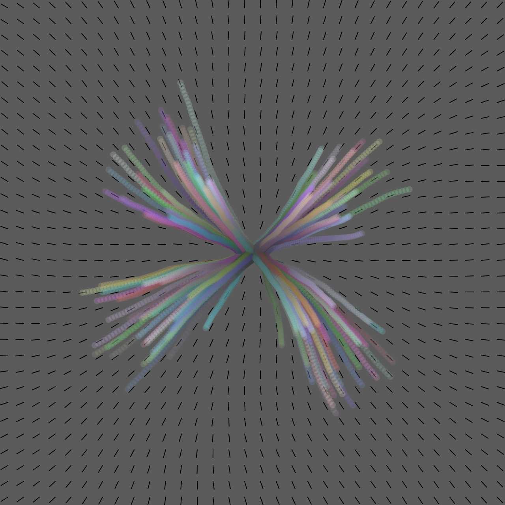
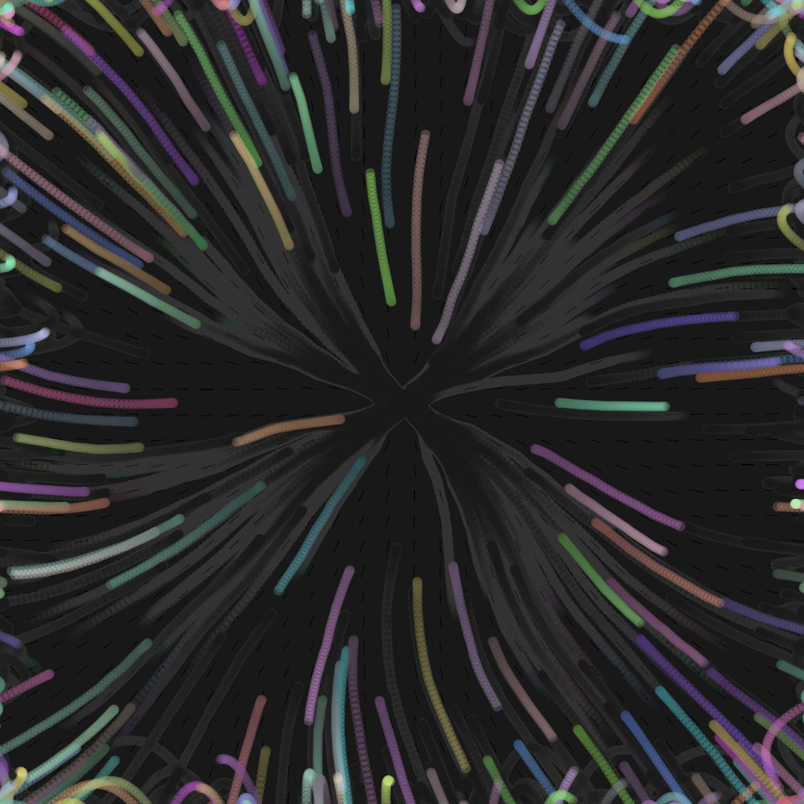

1. Flowfields
2. Brainstorming

Tengo dos ideas, cada una haciendo el pintado en el canvas, pero que los elementos vayan como electricidad por los tubos, aparecen, siguen el flujo y desaparecen, y en ello quiero hacer o que con clic ponga un punto en el que todo el movimiento se centra en ese punto, o que al presionar o mantener se genere un árbol para estos elementos hasta que desaparezcan.

3. Implementación

Primero es la adaptación del árbol, cambiando la opción de random del flowfield para que en vez de tener un movimiento aleatorio, se muevan de acuerdo a algo más controlado y desde el centro, además de la simulación, cambiar los vehiculos para que sean una particulas que desaparezcan con el tiempo.

Y al utilizar Enter se vuelva a generar particulas aleatoriamente en el canva y siguiendo el flujo.

4. Código

```js
let debug = true;

// Flowfield object
let flowfield;
// An ArrayList of vehicles
let vehicles = [];

function setup() {
  createCanvas(640, 640);
  // Make a new flow field with "resolution" of 16
  flowfield = new FlowField(20);
  // Make a whole bunch of vehicles with random maxspeed and maxforce values
  for (let i = 0; i < 120; i++) {
  let startX = width / 2 + random(-20, 20);
  let startY = height / 2 + random(-10, 10);
  vehicles.push(
    new Vehicle(startX, startY, random(2, 5), random(0.1, 0.5))
  );
}
}

function draw() {
  background(10, 10, 10, 5);
  // Display the flowfield in "debug" mode
  if (debug) flowfield.show();
  // Tell all the vehicles to follow the flow field
  for (let i = vehicles.length - 1; i >= 0; i--) {
  vehicles[i].follow(flowfield);
  vehicles[i].run();
  
  if (vehicles[i].lifespan <= 0) {
    vehicles.splice(i, 1);
  }
}
}

function keyPressed() {
  if (keyCode === ENTER) {
    emitParticles(120);
  }
}

function emitParticles(count) {
  for (let i = 0; i < count; i++) {
    let startX = random(width);
    let startY = random(height);
    vehicles.push(
      new Vehicle(startX, startY, random(2, 5), random(0.1, 0.5))
    );
  }
}

// Make a new flowfield
function mousePressed() {
  flowfield.init();
}

class Vehicle {
  constructor(x, y, ms, mf) {
    this.position = createVector(x, y);
    this.acceleration = createVector(0, 0);
    this.velocity = createVector(0, 0);
    this.r = 4;
    this.maxspeed = ms;
    this.maxforce = mf;
    this.lifespan = 150;
    this.color = color(random(100, 255), random(100, 255), random(100, 255));
  }

  run() {
    this.update();
    this.borders();
    this.show();
    this.lifespan -= 2;
  }

  // Implementing Reynolds' flow field following algorithm
  // http://www.red3d.com/cwr/steer/FlowFollow.html
  follow(flow) {
    // What is the vector at that spot in the flow field?
    let desired = flow.lookup(this.position);
    // Scale it up by maxspeed
    desired.mult(this.maxspeed);
    // Steering is desired minus velocity
    let steer = p5.Vector.sub(desired, this.velocity);
    steer.limit(this.maxforce); // Limit to maximum steering force
    this.applyForce(steer);
  }

  applyForce(force) {
    // We could add mass here if we want A = F / M
    this.acceleration.add(force);
  }

  // Method to update location
  update() {
    // Update velocity
    this.velocity.add(this.acceleration);
    // Limit speed
    this.velocity.limit(this.maxspeed);
    this.position.add(this.velocity);
    // Reset accelerationelertion to 0 each cycle
    this.acceleration.mult(0);
  }

  // Wraparound
  borders() {
    if (this.position.x < -this.r) this.position.x = width + this.r;
    if (this.position.y < -this.r) this.position.y = height + this.r;
    if (this.position.x > width + this.r) this.position.x = -this.r;
    if (this.position.y > height + this.r) this.position.y = -this.r;
  }

  show() {
    noStroke();
    this.color.setAlpha(this.lifespan); // fade out as lifespan decreases
    fill(this.color);
    ellipse(this.position.x, this.position.y, this.r * 2);
  }
}
```

https://editor.p5js.org/SheiinX/sketches/GRI00RlYq



