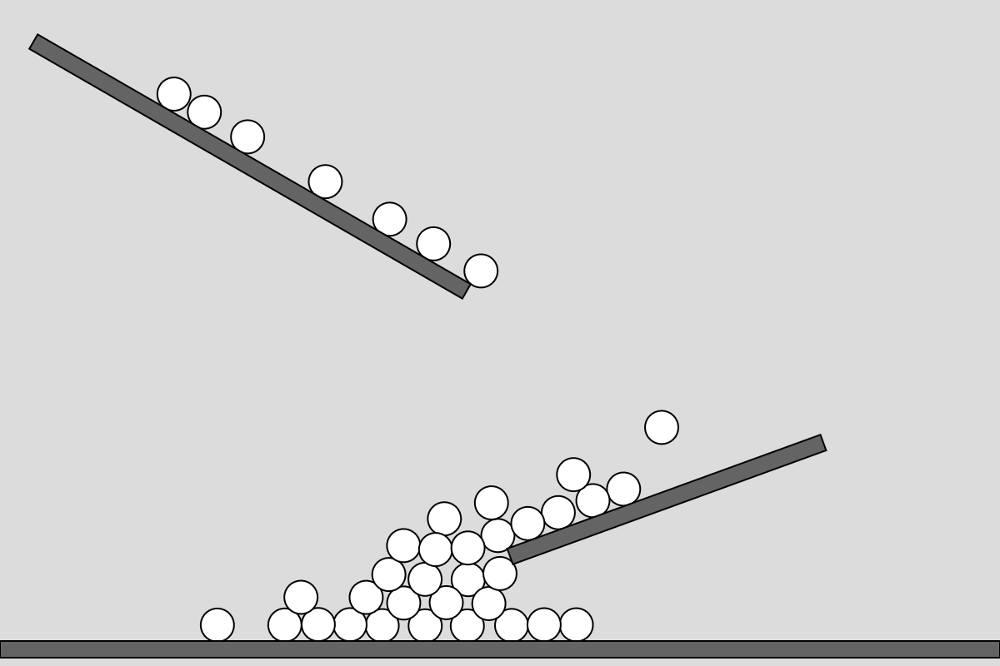
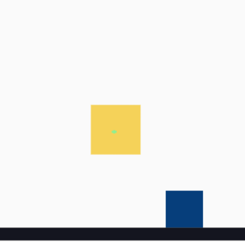

### 1. Conceptos

* Engine: Es el sistema detrás de la librería que maneja todo lo relacionado con las físicas utilizadas dentro del código.
* World: Entorno donde contiene todos los elementos como objetos, cuerpos y constrains, este espacio es como una Escena en Unity, tendrá y mostrará todos los elementos que se le apliquen a la escena
* Bodies: Veamos, Body son los elementos que físicos que se presentan en el World, como los rectángulos o los círculos, los cuales tienen una posición y una velocidad sobre el entorno. Mientras que Bodies son el namespace que agrupa todos los métodos y valores que hacen de ese objeto, como el rectángulo, y son los que permite construir todas las propiedades del objeto que se va a llamar.
* Constrain: Son las reglas que manejan y evitan ciertos comportamientos sobre el entorno y evitan colisiones dentro de lo codificado.
* MouseConstrain: Manejo de elementos del entorno por medio del mouse.
* Runner: Es el que maneja los tiempos dentro del Engine, y lo va actualizando a varios intervales (Como el draw), permitiendo el movimiento.
* Events: Actualizaciones de eventos o de situaciones que pasan dentro del entorno.
* Composite: El conjunto que tiene agrega lso elementos en el world.

### 2. Experimentar

```js
const {Engine, Body, Bodies, Composite, Render, Runner} = Matter;

let engine;
//let render;
//let runner;
let boxes = [];
let ground;

let velocity = 0.2;

function setup() {
  createCanvas(600, 400);
  engine = Engine.create();

  ground = [
    new Ground(400, 300, 200, 10, radians(-20)),
    new Ground(150, 100, 300, 10, radians(30)),
    new Ground(300, 390, 600, 10, 0)
  ];
}

function draw(){
  background(220);
  Engine.update(engine);
  
  for(let i = 0; i < boxes.length; i++){
    boxes[i].display();
  }
  for (let g of ground) {
    g.display();
  }
  
}

function mousePressed(){
  boxes.push(new Ball(mouseX, mouseY, 10));
}

class Ground {
  constructor(x, y, w, h, angle = 0) {
    this.w = w;
    this.h = h;
    this.body = Bodies.rectangle(x, y, w, h, {
      isStatic: true,
      angle: angle
    });
    Composite.add(engine.world, this.body);
  }

  display() {
    let pos = this.body.position;
    let angle = this.body.angle;

    push();
    rectMode(CENTER);
    translate(pos.x, pos.y);
    rotate(angle);
    fill(100);
    rect(0, 0, this.w, this.h);
    pop();
  }
}

class Ball {
  constructor(x, y, r) {
    this.r = r;
    this.body = Bodies.circle(x, y, this.r, {
      restitution: 0.6, // rebote
      friction: 0.1
    });
    Composite.add(engine.world, this.body);
  }

  display() {
    let pos = this.body.position;
    let angle = this.body.angle;

    push();
    translate(pos.x, pos.y);
    rotate(angle);
    ellipseMode(RADIUS);
    ellipse(0, 0, this.r);
    pop();
  }
}
```



https://editor.p5js.org/SheiinX/sketches/qnmPTwV5Z

```js
const {
    Engine,
    Render,
    Runner,
    World,
    Bodies,
    Mouse,
    MouseConstraint
  } = Matter;

  const engine = Engine.create();
  const { world } = engine;

  const render = Render.create({
    element: document.body,
    engine: engine,
    options: {
      width: 400,
      height: 400,
      wireframes: false,
      background: '#fafafa'
    }
  });

  Render.run(render);

  const runner = Runner.create();
  Runner.run(runner, engine);

  const boxA = Bodies.rectangle(200, 200, 80, 80);
  const boxB = Bodies.rectangle(300, 100, 60, 60);
  const ground = Bodies.rectangle(400, 380, 810, 20, { isStatic: true });

  World.add(world, [boxA, boxB, ground]);

  const mouse = Mouse.create(render.canvas);
  const mouseConstraint = MouseConstraint.create(engine, {
    mouse: mouse,
    constraint: {
      stiffness: 0.2,
      render: {
        visible: true
      }
    }
  });

  World.add(world, mouseConstraint);

  render.mouse = mouse;
```



https://editor.p5js.org/SheiinX/sketches/KIMI9u_-5

#### 3. Problemas

Ahora mismo con estos dos códigos, solo tuve una dificultad, y fue tener el mouseConstrain funcionando en el p5.js, así que aquí en el segundo solo se utilizó puro matter.js para aplicar el uso del mouseConstrain
