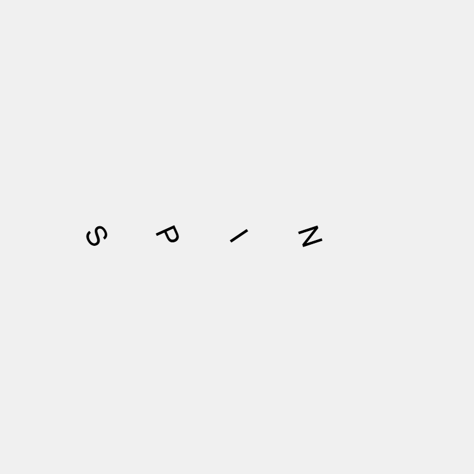

### 1. Palabra

Spin, o en español girar o giro, el significado habla por si mismo, la palabra representa el movimiento del objeto sobre su eje.

### 2. Idea

Para implementarlo, voy a aplicar la combinación de p5.js + matter.js, la cual me permitirá dibujar con p5 las letras, sobre el movimiento de matter.js por detrás, de está manera hará la ilusión de que se mueven las letras. Y la idea con esta palabra es la de utilizar el movimiento para que gire la palabra completa sobre si misma (Adicional: También hacer que con una tecla se gire la palabra entera y otra letra se gire las letras individualmente).

### 3. Código

p5.js + matter.js

```js
const { Engine, World, Bodies, Body, Constraint } = Matter;

let engine;
let world;
let letters = [];

function setup() {
  createCanvas(400, 400);

  engine = Engine.create();
  world = engine.world;
  engine.gravity.y = 0; // sin gravedad

  const word = "SPIN";
  let x = 80;

  for (let char of word) {
    letters.push(new LetterBlock(x, height / 2, 50, 50, char));
    x += 60;
  }
}

function draw() {
  background(240);
  Engine.update(engine);

  for (let l of letters) {
    l.display();

    if (keyIsDown(LEFT_ARROW)) {
      l.spin(-0.1);
    } else if (keyIsDown(RIGHT_ARROW)) {
      l.spin(0.1);
    }
  }
}

class LetterBlock {
  constructor(x, y, w, h, letter) {
    this.w = w;
    this.h = h;
    this.letter = letter;

    this.body = Bodies.rectangle(x, y, w, h, {
      frictionAir: 0.05,
      restitution: 0.3,
      friction: 0.5
    });

    World.add(world, this.body);

    // Constraint para mantener posición fija
    this.constraint = Constraint.create({
      bodyA: this.body,
      pointB: { x, y },
      length: 0,
      stiffness: 1
    });

    World.add(world, this.constraint);
  }

  spin(angularVelocity) {
    Body.setAngularVelocity(this.body, angularVelocity);
  }

  display() {
    let pos = this.body.position;
    let angle = this.body.angle;

    push();
    translate(pos.x, pos.y);
    rotate(angle);
    textAlign(CENTER, CENTER);
    textSize(24);
    fill(0);
    noStroke();
    text(this.letter, 0, 0);
    pop();
  }
}
```

https://editor.p5js.org/SheiinX/sketches/VKSjarUFW

matter.js

```js
const { Engine, Render, Runner, Bodies, Body, Composite, Constraint, Mouse, MouseConstraint, Events } = Matter;

let engine = Engine.create();
let world = engine.world;

let render = Render.create({
  element: document.body,
  engine: engine,
  options: {
    width: 600,
    height: 400,
    wireframes: false,
    background: "#f0f0f0"
  }
});

Render.run(render);
Runner.run(Runner.create(), engine);

// Letras y rotación
let letters = [];
let rotating = false;

// Crear letra con constraint fijo
function createLetterWithConstraint(x, y, w, h, letter) {
  const body = Bodies.rectangle(x, y, w, h, {
    render: { visible: false }
  });
  body.letter = letter;

  const constraint = Constraint.create({
    bodyA: body,
    pointB: { x, y },
    length: 0,
    stiffness: 1
  });

  Composite.add(world, [body, constraint]);
  return body;
}

// Crear palabra
const word = "SPIN";
let x = 150;
for (let i = 0; i < word.length; i++) {
  const b = createLetterWithConstraint(x, 200, 50, 50, word[i]);
  letters.push(b);
  x += 60;
}

// Mouse drag
const mouse = Mouse.create(render.canvas);
const mouseConstraint = MouseConstraint.create(engine, {
  mouse: mouse,
  constraint: {
    stiffness: 0.2,
    render: { visible: false }
  }
});
Composite.add(world, mouseConstraint);
render.mouse = mouse;

// Dibujar letras
Events.on(render, "afterRender", () => {
  const ctx = render.context;
  ctx.font = "32px Arial";
  ctx.fillStyle = "#000";
  ctx.textAlign = "center";
  ctx.textBaseline = "middle";

  for (let body of letters) {
    let pos = body.position;
    ctx.save();
    ctx.translate(pos.x, pos.y);
    ctx.rotate(body.angle);
    ctx.fillText(body.letter, 0, 0);
    ctx.restore();
  }
});

// Rotación en loop
Events.on(engine, "beforeUpdate", () => {
  if (rotating) {
    for (let body of letters) {
      Body.setAngularVelocity(body, 0.1); // velocidad de giro
    }
  }
});

// Teclado
window.addEventListener("keydown", (e) => {
  if (e.code === "Space") {
    rotating = true;
  }
});

window.addEventListener("keyup", (e) => {
  if (e.code === "Space") {
    rotating = false;
  }
});
```

https://editor.p5js.org/SheiinX/sketches/ErL2bvIxF

En cada código, o con space o con las flechas del teclado empiezan a girar las letras.



### 4. Formación de letras

La forma más fácil que he tenido para esto es, en vez de formar todas las letras a base de esos sistemas, simplemente utilizar los sistemas para que por debajo se tenga los objetos físicos sin que se muestren y por último se tenga gracias a funciones como el Event para generar las letras después de render

```js
Events.on(render, "afterRender", () => {
  const ctx = render.context;
  ctx.font = "32px Arial";
  ctx.fillStyle = "#000";
  ctx.textAlign = "center";
  ctx.textBaseline = "middle";

  for (let body of letters) {
    let pos = body.position;
    ctx.save();
    ctx.translate(pos.x, pos.y);
    ctx.rotate(body.angle);
    ctx.fillText(body.letter, 0, 0);
    ctx.restore();
  }
}); //matter.js
```

```js
display() {
    let pos = this.body.position;
    let angle = this.body.angle;

    push();
    translate(pos.x, pos.y);
    rotate(angle);
    textAlign(CENTER, CENTER);
    textSize(24);
    fill(0);
    noStroke();
    text(this.letter, 0, 0);
    pop();
  } //p5.js
```

Y por último teniendo un constrain y el engine.gravity.y = 0; para evitar que se movieran o cayeran los elementos, además de ponerlos en una posición fija

```js
this.constraint = Constraint.create({
      bodyA: this.body,
      pointB: { x, y },
      length: 0,
      stiffness: 1
    });
```

Y también para moverlos, cambiar la velocidad angular del objeto con un valor dado 

```js
spin(angularVelocity) {
    Body.setAngularVelocity(this.body, angularVelocity);
  }
```
